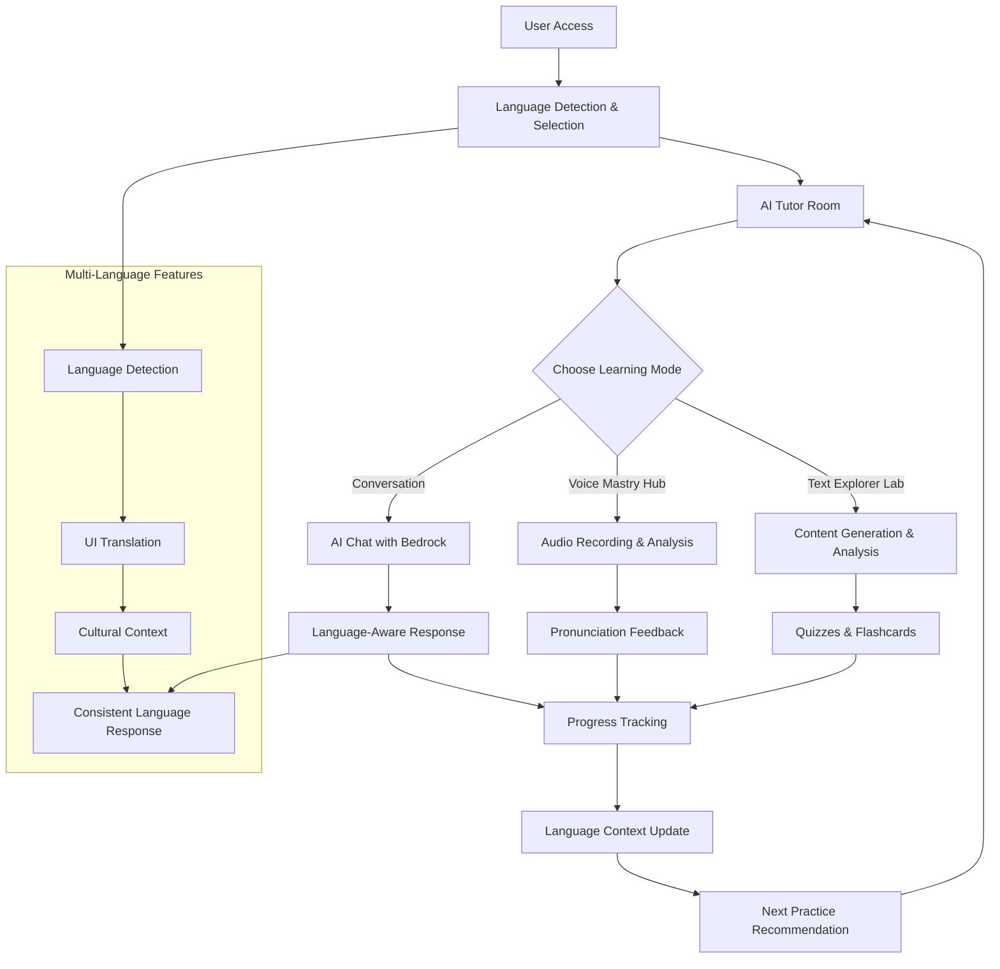
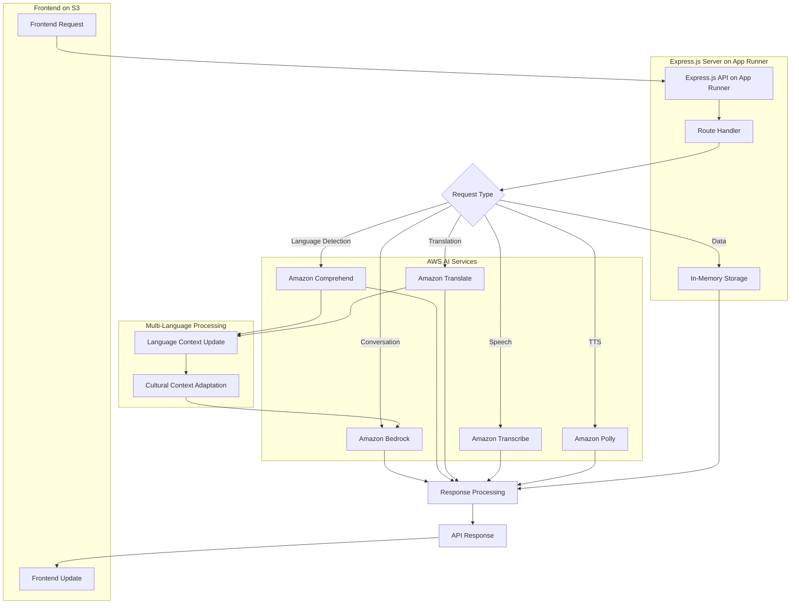

# AI-Powered Language Learning Companion

Complete AI-powered language learning platform with real-time conversation, pronunciation feedback, multi-language support (English/Chinese), and adaptive learning using AWS AI services.

## Demo Video
Watch the system in action: [YouTube Demo](https://www.youtube.com/watch?v=DEYFJtiCJsI)

## Commands
```bash
# Setup
cp env.example .env
npm install
cd backend; npm install
cd ../frontend; npm install

# AWS Services Setup
npm run setup-db    # Create DynamoDB tables
npm run setup-lex   # Set up Lex bot

# Development
npm run dev         # Start both frontend (localhost:3001) and backend (localhost:3000)

# Backend Deployment (App Runner)
cd backend
npm run setup:apprunner     # Initial setup for App Runner deployment
npm run deploy:apprunner    # Deploy to AWS App Runner
npm run docker:build        # Build Docker image
npm run docker:run          # Run Docker container locally

# Frontend Deployment (S3)
cd frontend
npm run build              # Build frontend
aws s3 sync dist/ s3://ai-language-learning-frontend-dev --delete  # Deploy to S3
```

## User Interface
- **Local Development**: 
  - Frontend: http://localhost:3001
  - Backend API: http://localhost:3000
- **Production**:
  - Frontend: http://ai-language-learning-frontend-dev.s3-website-ap-southeast-1.amazonaws.com/
  - Backend API: https://zkr9kgcmpu.ap-southeast-1.awsapprunner.com
- **API Health**: `/health`
- **Language Detection API**: `/api/language/detect`
- **Translation API**: `/api/language/translate`

## Tech Stack
- **Backend**: Node.js, Express.js, Docker
- **Frontend**: React, TypeScript, Vite, Tailwind CSS
- **Database**: In-memory storage (Map-based)
- **AI Services**: Amazon Bedrock, Comprehend, Translate, Transcribe, Polly
- **Cloud**: AWS App Runner, S3, ECR
- **Authentication**: Anonymous access
- **Multi-language**: AWS Comprehend (language detection), AWS Translate (translation)
- **Deployment**: AWS App Runner (backend), S3 (frontend)
- **Package Manager**: npm

## Project Structure
```
├── backend/                   # Express.js backend
│   ├── src/
│   │   ├── handlers/         # API route handlers
│   │   │   ├── conversation.js  # Conversation management
│   │   │   ├── language.js      # Language detection & translation
│   │   │   ├── reading.js       # Text Explorer Lab features
│   │   │   └── speech.js        # Speech processing
│   │   ├── services/         # AI service integrations
│   │   │   ├── bedrockService.js      # Amazon Bedrock AI
│   │   │   ├── languageDetectionService.js  # Language detection
│   │   │   ├── translationService.js        # Translation services
│   │   │   ├── conversationService.js       # Conversation management
│   │   │   ├── readingService.js            # Reading content generation
│   │   │   ├── speechService.js             # Speech processing
│   │   │   └── userService.js               # User management
│   │   ├── middleware/       # Express middleware
│   │   │   ├── auth.js           # Authentication
│   │   │   ├── errorHandler.js   # Error handling
│   │   │   ├── requestLogger.js  # Request logging
│   │   │   └── validation.js     # Input validation
│   │   └── index.js          # Main server file
│   ├── scripts/              # Deployment scripts
│   │   ├── deploy-apprunner.ps1    # App Runner deployment
│   │   └── setup-apprunner.ps1     # App Runner setup
│   └── Dockerfile            # Docker configuration
├── frontend/                  # React frontend
│   ├── src/
│   │   ├── components/       # React components
│   │   │   ├── AITutorRoom.tsx        # Main learning interface
│   │   │   ├── ConversationInterface.tsx  # Chat interface
│   │   │   ├── LanguageIndicator.tsx      # Language detection UI
│   │   │   ├── LanguageSwitcher.tsx       # Language selection
│   │   │   ├── Layout.tsx                 # Main layout
│   │   │   ├── ReadingMode.tsx            # Text Explorer Lab
│   │   │   └── SpeakingMode.tsx           # Voice Mastry Hub
│   │   ├── pages/            # Page components
│   │   │   └── HomePage.tsx           # Landing page
│   │   ├── contexts/         # React contexts
│   │   │   └── LanguageContext.tsx    # Language management
│   │   ├── services/         # API services
│   │   │   ├── api.ts                # API client
│   │   │   └── translationService.ts # Frontend translation
│   │   ├── locales/          # Translation files
│   │   │   ├── en.json               # English translations
│   │   │   └── zh.json               # Chinese translations
│   │   └── index.css         # Global styles
│   └── vite.config.ts        # Vite configuration
├── scripts/                   # Utility scripts
│   ├── setup-dynamodb.js     # Database setup
│   ├── setup-lex-bot.js      # Lex bot setup
│   └── test-audio.mp3        # Test audio file
└── env.example               # Environment template
```

## Features

### Core Learning Features
- **AI Tutor Room**: Comprehensive learning interface with multiple practice modes
- **Real-time Conversations**: AI-powered chat with Amazon Bedrock
- **Speech Processing**: Voice input/output with Transcribe and Polly
- **Text Explorer Lab**: AI-generated content with analysis, quizzes, and flashcards
- **Voice Mastry Hub**: Pronunciation feedback and speaking challenges
- **Interactive Learning**: Flashcards, quizzes, and comprehension questions

### Multi-Language Support
- **Language Detection**: Automatic language detection using AWS Comprehend
- **UI Translation**: Dynamic UI language switching (English/Chinese)
- **Cultural Context**: AI responses adapted to Western/Chinese cultural contexts
- **Bilingual AI**: AI responds in the same language as user input
- **Translation Services**: Real-time text translation using AWS Translate
- **Language Consistency**: Maintains language context throughout conversations

### AI-Powered Features
- **Conversational AI**: Natural language understanding and generation with Bedrock
- **Speech Recognition**: Real-time audio transcription with confidence scoring
- **Text-to-Speech**: Multiple voice options and languages
- **Intelligent Feedback**: Contextual corrections and suggestions
- **Content Generation**: AI-generated reading passages, quizzes, and flashcards
- **Pronunciation Analysis**: Detailed feedback on speaking performance
- **Language-Aware Responses**: AI responses match user's input language

## AWS Services Used

### Core AI Services
- **Amazon Bedrock**: Advanced AI models for conversations, grammar correction, and content generation
- **Amazon Comprehend**: Language detection and sentiment analysis
- **Amazon Translate**: Text translation between English and Chinese
- **Amazon Transcribe**: Speech-to-text conversion with confidence scoring
- **Amazon Polly**: Text-to-speech synthesis with multiple voices

### Infrastructure Services
- **AWS App Runner**: Container-based backend hosting
- **Amazon ECR**: Docker container registry
- **Amazon S3**: Frontend hosting and file storage
- **AWS CloudWatch**: Monitoring and logging
- **In-Memory Storage**: Map-based storage for conversations

### Security & Management
- **AWS IAM**: Identity and access management
- **AWS Secrets Manager**: Secure credential storage
- **AWS CloudFormation**: Infrastructure as code

## System Flow

### Application Flow


### AWS Services Flow

