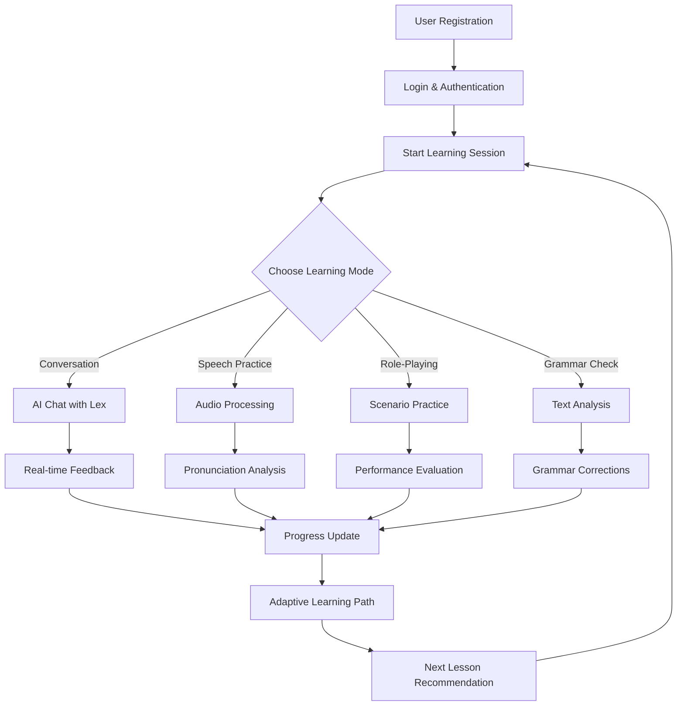
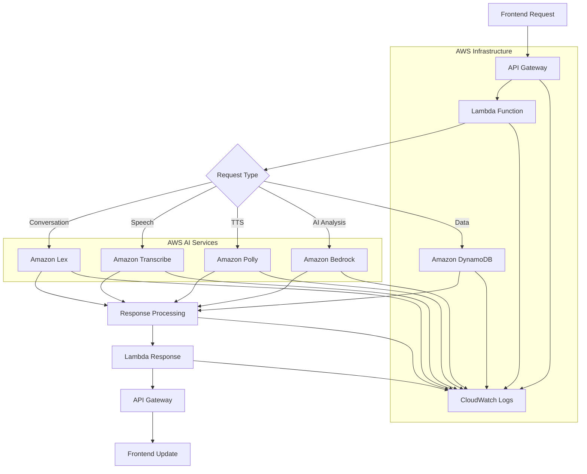

# AI-Powered Language Learning Companion

Complete AI-powered language learning platform with real-time conversation, pronunciation feedback, and adaptive learning using AWS AI services.

## Commands
```bash
# Setup
cp env.example .env
npm install
cd backend && npm install
cd ../frontend && npm install

# AWS Services Setup
npm run setup-db    # Create DynamoDB tables
npm run setup-lex   # Set up Lex bot

# Development
npm run dev         # Start both frontend (localhost:5173) and backend (localhost:3000)
npm run backend     # Backend API only
npm run frontend    # React app only

# Testing
npm run test                    # Run all tests
npm run test-integration        # Test all services
npm run test-user              # Test user management
npm run test-conversation      # Test conversation features
npm run test-speech            # Test speech processing
npm run test-adaptive          # Test adaptive learning
npm run test-roleplay          # Test role-playing scenarios

# Deployment
npm run deploy                 # Deploy complete system
cd backend && npm run deploy  # Backend only
cd frontend && npm run build  # Frontend build
aws s3 sync dist/ s3://your-bucket-name --delete  # Deploy frontend to S3
```

## User Interface
- **Main App**: http://localhost:5173
- **API Health**: http://localhost:3000/health

## Tech Stack
- **Backend**: Node.js, Express.js, Serverless Framework
- **Frontend**: React, TypeScript, Vite, Tailwind CSS
- **Database**: Amazon DynamoDB
- **AI Services**: Amazon Lex, Bedrock, Transcribe, Polly
- **Cloud**: AWS Lambda, API Gateway, S3
- **Authentication**: JWT
- **Deployment**: Serverless Framework
- **Package Manager**: npm

## Project Structure
```
├── backend/                   # Serverless backend
│   ├── src/
│   │   ├── handlers/         # Lambda handlers
│   │   ├── services/         # AI service integrations
│   │   ├── middleware/       # Express middleware
│   │   └── models/           # Data models
│   └── serverless.yml        # Serverless configuration
├── frontend/                  # React frontend
│   ├── src/
│   │   ├── components/       # React components
│   │   ├── pages/            # Page components
│   │   ├── services/         # API services
│   │   └── types/            # TypeScript types
│   └── vite.config.ts        # Vite configuration
├── scripts/                   # Utility scripts
│   ├── setup-dynamodb.js     # Database setup
│   ├── setup-lex-bot.js      # Lex bot setup
│   ├── deploy-to-aws.js      # Deployment script
│   └── test-*.js             # Testing scripts
├── env.example               # Environment template
└── .env                      # Environment configuration
```

## Features

### Core Learning Features
- **Real-time Conversations**: AI-powered chat with Amazon Lex
- **Speech Processing**: Voice input/output with Transcribe and Polly
- **Pronunciation Feedback**: Detailed phoneme-level analysis
- **Grammar Correction**: Contextual grammar analysis with Bedrock
- **Adaptive Learning**: Personalized learning paths based on progress
- **Role-Playing Scenarios**: Immersive practice scenarios

### User Management
- **User Registration**: Secure account creation with JWT
- **Profile Management**: Customizable learning preferences
- **Progress Tracking**: Detailed analytics and milestones
- **Multi-language Support**: Learn multiple languages simultaneously

### AI-Powered Features
- **Conversational AI**: Natural language understanding and generation
- **Speech Recognition**: Real-time audio transcription
- **Text-to-Speech**: Multiple voice options and languages
- **Intelligent Feedback**: Contextual corrections and suggestions
- **Learning Analytics**: AI-driven progress analysis

## AWS Services Used

### Core AI Services
- **Amazon Lex**: Conversational AI for natural language interactions
- **Amazon Bedrock**: Advanced AI models for grammar correction and content generation
- **Amazon Transcribe**: Speech-to-text conversion with confidence scoring
- **Amazon Polly**: Text-to-speech synthesis with multiple voices

### Infrastructure Services
- **AWS Lambda**: Serverless compute for API endpoints
- **Amazon API Gateway**: RESTful API management and routing
- **Amazon DynamoDB**: NoSQL database for user data and conversations
- **Amazon S3**: File storage for audio files and generated content
- **AWS CloudWatch**: Monitoring and logging

### Security & Management
- **AWS IAM**: Identity and access management
- **AWS Secrets Manager**: Secure credential storage
- **AWS CloudFormation**: Infrastructure as code

## System Flow

### Application Flow


### AWS Services Flow

