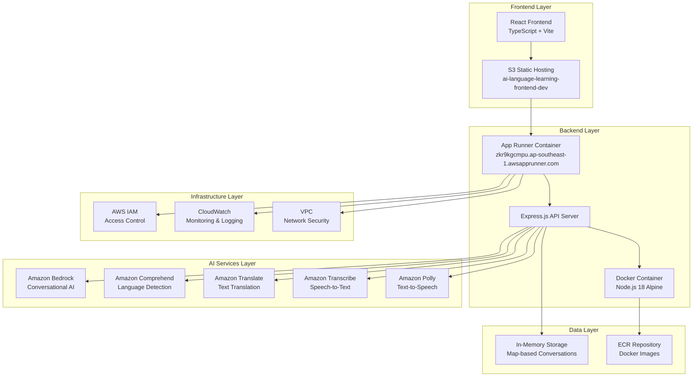
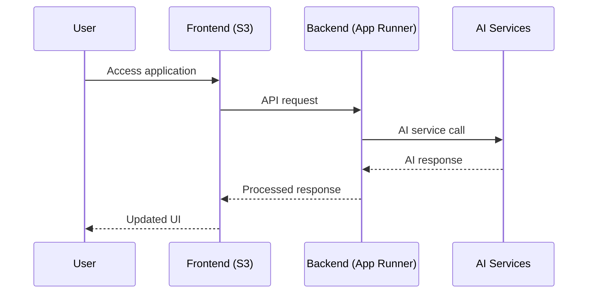
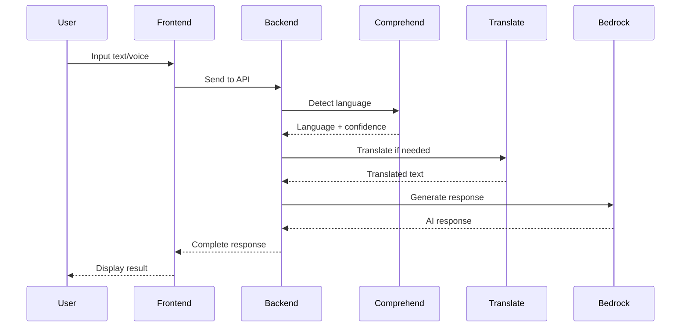

# System Architecture Documentation

## AI-Powered Language Learning Companion

### Overview

The AI-Powered Language Learning Companion is a comprehensive language learning platform that leverages AWS AI services to provide personalized, immersive language learning experiences. The system architecture is designed for scalability, reliability, and cost-effectiveness using modern cloud-native technologies.

## System Architecture Diagram



## Architecture Components

### 1. Frontend Layer

**Technology Stack:**
- **React 18** with TypeScript
- **Vite** for build tooling and development server
- **Tailwind CSS** for styling
- **Axios** for API communication

**Deployment:**
- Hosted on **Amazon S3** with static website hosting
- URL: `https://ai-language-learning-frontend-dev.s3-website-ap-southeast-1.amazonaws.com`
- Automatic deployment via AWS CLI sync

**Key Features:**
- Responsive design for multiple devices
- Real-time language switching (English/Chinese)
- Progressive Web App capabilities
- Optimized bundle size with code splitting

### 2. Backend Layer

**Technology Stack:**
- **Node.js 18** with Express.js framework
- **Docker** containerization
- **Winston** for logging
- **Joi** for input validation
- **Helmet** for security headers

**Deployment:**
- **AWS App Runner** for containerized hosting
- URL: `https://zkr9kgcmpu.ap-southeast-1.awsapprunner.com`
- Automatic scaling based on demand
- Health checks and monitoring

**API Endpoints:**
```
GET  /health                    - Health check
POST /api/conversation/start    - Start new conversation
POST /api/conversation/message  - Send message
POST /api/language/detect       - Detect language
POST /api/language/translate    - Translate text
POST /api/speech/transcribe     - Convert speech to text
POST /api/speech/synthesize     - Convert text to speech
POST /api/reading/analyze       - Analyze reading content
POST /api/reading/content       - Generate reading content
```

### 3. AI Services Integration

#### Amazon Bedrock
- **Purpose**: Conversational AI for realistic dialogues
- **Model**: Claude 3.5 Sonnet
- **Usage**: 
  - Generating contextual conversations
  - Creating personalized learning scenarios
  - Providing intelligent feedback
  - Cultural context adaptation

#### Amazon Comprehend
- **Purpose**: Language detection and sentiment analysis
- **Features**:
  - Automatic language detection with confidence scoring
  - Sentiment analysis for emotional context
  - Batch processing for multiple texts
- **Usage**: Determining user's native language and emotional state

#### Amazon Translate
- **Purpose**: Real-time text translation
- **Supported Languages**: English ↔ Chinese (Simplified/Traditional)
- **Features**:
  - Context-aware translation
  - Cultural adaptation
  - Batch translation support
- **Usage**: UI translation and content localization

#### Amazon Transcribe
- **Purpose**: Speech-to-text conversion
- **Features**:
  - Real-time transcription
  - Confidence scoring
  - Multiple language support
  - Custom vocabulary support
- **Usage**: Voice input processing for speaking practice

#### Amazon Polly
- **Purpose**: Text-to-speech synthesis
- **Features**:
  - Multiple voice options per language
  - Natural speech patterns
  - SSML support for pronunciation control
  - Neural voices for enhanced quality
- **Usage**: Audio feedback and pronunciation examples

### 4. Data Management

#### In-Memory Storage
- **Technology**: JavaScript Map objects
- **Purpose**: Temporary conversation storage
- **Features**:
  - Fast read/write operations
  - Automatic cleanup
  - Session-based data isolation
- **Limitations**: Data lost on server restart (acceptable for demo)

#### ECR Repository
- **Purpose**: Docker image storage
- **Features**:
  - Versioned container images
  - Security scanning
  - Cross-region replication
- **Usage**: Storing backend application container images

### 5. Infrastructure & Security

#### AWS App Runner
- **Purpose**: Container hosting and management
- **Features**:
  - Automatic scaling (1-10 instances)
  - Load balancing
  - Health monitoring
  - Auto-deployment from ECR
- **Configuration**: 
  - CPU: 1 vCPU
  - Memory: 2 GB
  - Region: ap-southeast-1 (Singapore)

#### AWS IAM
- **Purpose**: Access control and permissions
- **Roles**:
  - App Runner execution role
  - ECR access role
  - AI services access policies
- **Security**: Least privilege principle

#### Amazon S3
- **Purpose**: Frontend hosting and file storage
- **Configuration**:
  - Static website hosting
  - Public read access
  - Versioning enabled
  - CloudFront integration (optional)

#### CloudWatch
- **Purpose**: Monitoring and logging
- **Features**:
  - Application logs
  - Performance metrics
  - Error tracking
  - Custom dashboards

## Data Flow Architecture

### 1. User Interaction Flow


### 2. Language Learning Flow


## Scalability & Performance

### Horizontal Scaling
- **App Runner**: Automatic scaling based on CPU and memory usage
- **S3**: Unlimited storage and bandwidth
- **AI Services**: Built-in scalability and global availability

### Performance Optimizations
- **Frontend**: Code splitting and lazy loading
- **Backend**: Connection pooling and caching
- **AI Services**: Batch processing for multiple requests
- **CDN**: CloudFront for global content delivery (optional)

### Cost Optimization
- **App Runner**: Pay-per-use pricing model
- **S3**: Standard storage with lifecycle policies
- **AI Services**: Pay-per-request pricing
- **No persistent database**: Reduces infrastructure costs

## Security Architecture

### Network Security
- **VPC**: Isolated network environment
- **Security Groups**: Controlled inbound/outbound traffic
- **HTTPS**: End-to-end encryption

### Data Security
- **IAM**: Fine-grained access control
- **Encryption**: Data encrypted in transit and at rest
- **No PII Storage**: Temporary in-memory storage only

### Application Security
- **Helmet**: Security headers
- **Input Validation**: Joi schema validation
- **Rate Limiting**: Built into App Runner
- **CORS**: Controlled cross-origin requests

## Monitoring & Observability

### Application Monitoring
- **Health Checks**: Automated endpoint monitoring
- **Log Aggregation**: Centralized logging with CloudWatch
- **Error Tracking**: Structured error logging
- **Performance Metrics**: Response time and throughput monitoring

### Business Metrics
- **User Engagement**: Session duration and interaction patterns
- **AI Service Usage**: Request volume and response quality
- **Cost Tracking**: Real-time cost monitoring per service

## Deployment Pipeline

### Backend Deployment
1. **Code Commit**: Push to repository
2. **Docker Build**: Create container image
3. **ECR Push**: Upload to container registry
4. **App Runner Update**: Deploy new container
5. **Health Check**: Verify deployment success

### Frontend Deployment
1. **Build**: Create production bundle
2. **S3 Sync**: Upload to S3 bucket
3. **Cache Invalidation**: Clear CDN cache (if applicable)
4. **Verification**: Test live deployment

## Disaster Recovery

### Backup Strategy
- **Code**: Git repository with remote backup
- **Container Images**: ECR with cross-region replication
- **Configuration**: Infrastructure as Code

### Recovery Procedures
- **Application Failure**: Automatic restart via App Runner
- **Data Loss**: Rebuild from code (acceptable for demo)
- **Service Outage**: Multi-AZ deployment for high availability

## Future Scalability Considerations

### Database Migration
- **Current**: In-memory storage
- **Future**: DynamoDB or RDS for persistent data
- **Migration**: Gradual transition with backward compatibility

### Microservices Architecture
- **Current**: Monolithic backend
- **Future**: Service decomposition by domain
- **Benefits**: Independent scaling and deployment

### Global Deployment
- **Current**: Single region (ap-southeast-1)
- **Future**: Multi-region deployment
- **Benefits**: Reduced latency and improved availability
